# Embrace the grind!

<!--
**bananabread08/bananabread08** is a ✨ _special_ ✨ repository because its `README.md` (this file) appears on your GitHub profile.-->
Juggling between software and data.

### My Everyday Tech & Tools

 
 

